# MPC_UAV_ACADOS

Control predictivo por modelo (MPC) para UAV cuadrotor usando [acados](https://github.com/acados/acados) y CasADi. El controlador opera sobre un modelo simplificado con representación de orientación en cuaterniones y se ejecuta de forma **standalone** (sin dependencias de ROS).

---

## Archivos principales

| Archivo | Descripción |
|---|---|
| `T_MPC_SimpleModel_Quat_external.py` | NMPC baseline, modelo con **cuaternión** (11 estados). Standalone. |
| `T_MPC_SimpleModel_Euler_external.py` | NMPC baseline, modelo con **yaw Euler** (8 estados). Standalone. |
| `T_MPC_SimpleModel_Quat_CBF.py` | NMPC cuaternión **+ filtro de seguridad CBF** (evasión de obstáculos). |
| `T_MPC_SimpleModel_Euler_CBF.py` | NMPC Euler **+ filtro de seguridad CBF**. |
| `Functions_SimpleModel.py` | Modelo simbólico CasADi, integrador RK4, utilidades de cuaterniones. |
| `Functions_CBF.py` | **Filtro CBF, cámara de profundidad simulada y memoria de obstáculos. Solo funciones, sin clases.** |
| `fancy_plots.py` | Funciones de visualización. |
| `results/<carpeta>/` | Figuras y `run_data.npz` de cada corrida (ver [Ejecución](#ejecución)). |

Los scripts `T_MPC_SimpleModel_External.py`, `T_MPC_Linear_SimpleModel.py`, `T_UAV_DMD_acados*.py` y
`P_UAV_simple.py` son las versiones **ROS1** originales (`rospy`) y no corren sin ROS1.

---

## Cambios recientes

### Eliminación de dependencias ROS1
El archivo `T_MPC_SimpleModel_Quat_external.py` y `Functions_SimpleModel.py` fueron migrados para ejecutarse **sin ROS**:

- Removidos: `rospy`, `nav_msgs`, `geometry_msgs`, `std_msgs`
- `rospy.Rate` → `time.sleep` con control de timing manual
- `rospy.Subscriber / Publisher / init_node` → eliminados
- `send_velocity_control(u, pub, msg)` → `send_control(u)` que imprime el control por consola
- `pub_odometry_sim_quat(...)` → stub vacío (estado se mantiene internamente)
- `publish_matrix(...)` → stub vacío
- `get_odometry_simple_quat()` → `get_initial_state()` con estado inicial fijo
- `odometry_call_back` → eliminado

### Actualización de API acados
- `ocp.dims.N` → `ocp.solver_options.N_horizon` (nueva API)
- `ocp.p = model.p` → eliminado (causaba error de serialización MX al volcar JSON)
- Las expresiones de costo ahora referencian `model.p` directamente

### Actualización de CasADi
- Reemplazados múltiples `from casadi import X` → `import casadi as ca`
- Uso estilo moderno: `ca.MX.zeros(...)`, `ca.MX.sym(...)`, etc.

---

## Modelo del sistema en forma matricial

El modelo está implementado en `f_system_simple_model_quat()` dentro de `Functions_SimpleModel.py`.

### Vector de estados (n=11)

```
x = [nx, ny, nz, qw, qx, qy, qz, ul, um, un, w]ᵀ
```

| Variable | Descripción |
|---|---|
| `nx, ny, nz` | Posición en marco inercial |
| `qw, qx, qy, qz` | Orientación como cuaternión unitario |
| `ul, um, un` | Velocidades lineales en marco cuerpo (surge, sway, heave) |
| `w` | Velocidad angular de guiñada (yaw rate) |

### Vector de control (m=4)

```
u = [ul_ref, um_ref, un_ref, w_ref]ᵀ
```

Representan las velocidades de referencia de entrada al modelo dinámico.

### Dinámica explícita

El modelo completo tiene la forma **lineal por partes** (afín en x y u):

```
ẋ = A(x) · x + B · u
```

La matriz A depende del estado (a través de la rotación J(q) y la matriz de Coriolis C(w)), por lo que el sistema es **no lineal** aunque está escrito en estructura matricial por bloques. La dinámica se divide en tres subsistemas:

---

#### 1. Cinemática de posición

```
[ṅx]         [ul]
[ṅy] = J(q)·[um]
[ṅz]         [un]
```

Donde J(q) ∈ ℝ³ˣ³ es la matriz de rotación obtenida del cuaternión mediante la fórmula de Rodrigues (función `QuatToRot`):

```
J(q) = I₃ + 2·q̂² + 2·q₀·q̂
```

Con q̂ la matriz antisimétrica de la parte vectorial del cuaternión normalizado:

```
q̂ = [  0  , -qz,  qy ]
    [  qz ,   0 , -qx ]
    [ -qy ,  qx ,   0 ]
```

En la estructura matricial A esto corresponde al bloque:

```
A₁ = [ 0₃ₓ₇ | J(q) | 0₃ₓ₁ ]   ∈ ℝ³ˣ¹¹
```

---

#### 2. Cinemática del cuaternión

La evolución del cuaternión bajo velocidad angular [p, q, r] = [0, 0, w] es:

```
q̇ = ½ · S(ω) · q
```

Con la matriz de multiplicación cuaterniónica S(ω):

```
S(ω) = [ 0,  -p,  -q,  -r ]     Con p=0, q=0, r=w:
        [ p,   0,   r,  -q ]
        [ q,  -r,   0,   p ]     S(w) = [  0,  0,  0, -w ]
        [ r,   q,  -p,   0 ]            [  0,  0,  w,  0 ]
                                         [  0, -w,  0,  0 ]
                                         [  w,  0,  0,  0 ]
```

En la estructura matricial A este bloque es:

```
A₂ = [ 0₄ₓ₃ | ½·S(w) | 0₄ₓ₄ ]   ∈ ℝ⁴ˣ¹¹
```

---

#### 3. Dinámica de velocidades (modelo de segundo orden)

```
[u̇l]                  [ul]
[u̇m] = -M⁻¹·C(w) ·  [um]  +  M⁻¹ · u
[u̇n]                  [un]
[ẇ ]                  [ w]
```

Donde:
- **M** ∈ ℝ⁴ˣ⁴ es la matriz de masa/inercia (constante, función de parámetros identificados `chi`):

```
M = [ χ₀,   0,   0,  0   ]
    [  0,  χ₂,   0,  0   ]
    [  0,   0,  χ₄,  0   ]
    [  0,   0,   0,  χ₈  ]
```

- **C(w)** ∈ ℝ⁴ˣ⁴ es la matriz de Coriolis/amortiguamiento (depende del yaw rate w):

```
C(w) = [ χ₉,    w·χ₁₀,  0,     0     ]
        [ w·χ₁₂, χ₁₃,   0,     0     ]
        [  0,     0,    χ₁₅,   0     ]
        [  0,     0,     0,    χ₁₈   ]
```

En la estructura matricial A este bloque es:

```
A₃ = [ 0₄ₓ₇ | -M⁻¹·C(w) ]   ∈ ℝ⁴ˣ¹¹
```

---

#### Estructura completa

```
     [ A₁ ]   [ 0₃ₓ₇ |  J(q)    | 0₃ₓ₁      ]
A =  [ A₂ ] = [ 0₄ₓ₃ |  ½·S(w)  | 0₄ₓ₄      ]   ∈ ℝ¹¹ˣ¹¹
     [ A₃ ]   [ 0₄ₓ₇ | -M⁻¹·C(w)            ]


     [ 0₇ₓ₄ ]
B =  [       ]   ∈ ℝ¹¹ˣ⁴
     [ M⁻¹  ]
```

La ecuación de estado queda:

```
ẋ = A(x) · x + B · u
```

El integrador numérico utilizado es **Runge-Kutta de orden 4 (RK4)** implementado en `f_d()`.

---

## Función de costo del MPC

El problema de control óptimo resuelve en cada instante:

```
min  Σ_{k=0}^{N-1} [ eₚᵀ Q eₚ + uᵀ R u + log(qₑ)ᵀ K log(qₑ) ]
 u                + eₚ_N ᵀ Q eₚ_N + log(qₑ_N)ᵀ K log(qₑ_N)
```

Donde:
- **eₚ = p_d - p** ∈ ℝ³ : error de posición
- **qₑ = q⁻¹ ⊗ q_d** : error de orientación en cuaternión (producto cuaterniónico)
- **log(qₑ)** ∈ ℝ³ : mapa logarítmico del cuaternión de error (distancia geodésica en SO(3))
- **Q = diag(1.1, 1.1, 1.1)** : peso posición
- **K = diag(1.1, 1.1, 1.1)** : peso orientación
- **R = diag(1, 1, 1, 1)** : peso control

### Mapa logarítmico del cuaternión

```
log(q) = 2 · arctan2(‖qᵥ‖, q₀) · qᵥ / ‖qᵥ‖
```

Implementado en `log_cuaternion_casadi()`. Si q₀ < 0 se aplica q → -q antes para garantizar la rama principal.

---

## Parámetros del solver

| Parámetro | Valor |
|---|---|
| Horizonte N | 51 nodos |
| Tiempo de predicción | 51/30 ≈ 1.7 s |
| Frecuencia de control | 30 Hz |
| Integrador | ERK (Runge-Kutta explícito) |
| Solver NLP | SQP_RTI |
| Solver QP | FULL_CONDENSING_HPIPM |
| Tolerancia | 1e-3 |

---

## Ejecución

Ninguno de los scripts standalone requiere ROS. Cada uno crea su carpeta de resultados.

| Comando | Resultados en |
|---|---|
| `python3 T_MPC_SimpleModel_Quat_external.py` | `results/baseline/` |
| `python3 T_MPC_SimpleModel_Euler_external.py` | `results/baseline_euler/` |
| `python3 T_MPC_SimpleModel_Quat_CBF.py` | `results/cbf/` (o `results/nocbf/` con `opcion = "NMPC"`) |
| `python3 T_MPC_SimpleModel_Euler_CBF.py` | `results/cbf_euler/` (o `results/nocbf_euler/`) |

Figuras: `1_pose` (pose vs referencia), `2_error_pose`, `3_Time` (cómputo por iteración). Los scripts
CBF añaden `4_distance` (distancia a cada obstáculo vs d_s), `5_control` (u_nmpc vs u_safe),
`6_xy` (vista superior), `7_camera` (lo que ve la cámara: rango, bearing, visible/conocido),
`8_side3d.jpg` (vistas laterales y 3D) y `run_data.npz` con todas las señales.

> Las vistas 2D (`6_xy`, `8_side3d`) son **proyecciones**: la trayectoria puede cruzar el círculo de
> un obstáculo y aun así pasar a un lado en 3D. La prueba de no colisión es `4_distance`.

---

## Filtro de seguridad CBF (Control Barrier Function)

### Idea

El NMPC sigue la trayectoria. Un **QP pequeño** corrige su salida lo mínimo necesario para que el dron
no entre en una esfera de radio `d_s` alrededor de cada obstáculo. El NMPC no sabe que hay
obstáculos; toda la seguridad está en el filtro.

```
x_k ──► NMPC (acados) ──► u_nmpc ──► QP-CBF ──► u_safe ──► planta
                                       ▲
              cámara de profundidad ───┘  r_b (vector al obstáculo, marco cuerpo)
```

### Qué necesita el filtro (y qué no)

| Entrada | Símbolo | De dónde sale |
|---|---|---|
| Vector relativo al obstáculo, **marco cuerpo** | `r_b ∈ ℝ³` | cámara de profundidad: píxel + depth → punto 3D → extrínsecos cámara→cuerpo |
| Velocidades lineales en marco cuerpo | `v = [ul, um, un]` | odometría (ya son estados del modelo) |
| Velocidad de yaw | `w` | odometría |
| Acción nominal del NMPC | `u_nmpc ∈ ℝ⁴` | salida del NMPC |

**No necesita** la orientación del dron (cuaternión o ψ) ni la posición inercial: la barrera está
escrita en marco cuerpo. Por eso el mismo `Functions_CBF.py` sirve para el modelo cuaternión y el
modelo Euler sin cambiar nada.

Una **distancia escalar sola no basta**: el QP necesita la dirección hacia el obstáculo (gradiente).
Si el sensor entrega distancia `d`, azimut `az` y elevación `el`:

```
r_b = d · [cos(el)·cos(az),  cos(el)·sin(az),  sin(el)]
```

### Matemática

Obstáculo estático en marco inercial. Su vector relativo en marco cuerpo evoluciona con
`ṙ_b = −v − ω × r_b`, con `ω = [0, 0, w]`.

```
h(x)  = ‖r_b‖² − d_s²                       (h ≥ 0  ⇔  fuera de la esfera)
ḣ     = −2 r_bᵀ v                             (el término ω×r_b se anula: r_bᵀ(ω×r_b) = 0)
ḧ     = 2‖v‖² + 2 (ω × r_b)ᵀ v − 2 r_bᵀ v̇

v̇     = M_l⁻¹ u_l − [M⁻¹ C(w) ν]_l           ν = [ul, um, un, w],  M_l = diag(χ₀, χ₂, χ₄)
```

`h` tiene grado relativo 2 respecto a `u` (u entra en `v̇`), así que se usa una **HOCBF de orden 2**
(exponencial): con `ψ₁ = ḣ + α₁ h` se exige `ψ̇₁ + α₂ ψ₁ ≥ 0`, es decir

```
ḧ + (α₁ + α₂) ḣ + α₁ α₂ h  ≥  0
```

Como `ḧ = a₀ + bᵀ u` es **afín en u**, la restricción es lineal:

```
a₀ = 2‖v‖² + 2 (ω×r_b)ᵀ v + 2 r_bᵀ [M⁻¹ C ν]_l
b  = [ −2 r_b / diag(M_l) ,  0 ]              (solo actúa sobre ul_ref, um_ref, un_ref)

bᵀ u  ≥  −a₀ − (α₁+α₂) ḣ − α₁α₂ h  =:  c
```

**QP** (una restricción por obstáculo, slack `δᵢ` para no quedar infactible con los límites de `u`):

```
min   ½ ‖u − u_nmpc‖² + ρ/2 ‖δ‖²
 u,δ
s.t.  bᵢᵀ u + δᵢ ≥ cᵢ        i = 1..n_obs
      u_min ≤ u ≤ u_max
```

Se resuelve con qpOASES vía `casadi.conic`. Tarda ~0.2 ms.

### Funciones de `Functions_CBF.py`

| Función | Entradas | Salida |
|---|---|---|
| `cbf_terms(r_b, v, w, d_safe)` | vector relativo (3,), vel. cuerpo (3,), yaw rate, distancia de barrera | `h, h_dot, a0, b` |
| `create_cbf_qp(n_obs, rho)` | nº de obstáculos, peso del slack | `qp, H` (se crea **una vez**) |
| `cbf_filter(qp, H, u_nmpc, r_list, known, v, w, d_safe, alpha1, alpha2, u_min, u_max)` | `r_list` (n_obs, 3), `known` (n_obs,) bool | `u_safe (4,), activo (bool)` |
| `camera_depth_sim(p, R, obstacles, sense_range, fov_deg)` | posición (3,), rotación cuerpo→inercial (3×3), centros (n_obs, 3) | `r_b (n_obs,3), visible (n_obs,)` — **solo simulación** |
| `obstacle_memory(r_mem, age, r_meas, visible, v, w, ts, t_forget)` | memoria previa + medida nueva | `r_mem, age, known` |
| `rot_quat(q)`, `rot_euler(psi)` | orientación | matriz de rotación cuerpo→inercial (para la cámara simulada) |
| `M_matrix()`, `C_matrix(w)` | — | matrices del modelo en numpy |

### Cómo usarlo en otro proyecto (copiar y pegar)

Copia `Functions_CBF.py` a tu proyecto. Si tu modelo tiene otra `M`/`C`, cambia `chi`, `M_matrix()` y
`C_matrix(w)`; si tu `v̇` es otra cosa, cambia solo `cbf_terms()`. Lo demás no depende del modelo.

**1. Antes del lazo (una vez):**

```python
import numpy as np
from Functions_CBF import create_cbf_qp, cbf_filter, obstacle_memory

n_obs   = 3                                  # obstáculos que puede haber a la vez
d_safe  = 1.0                                # radio del obstáculo + margen [m]
alpha1  = 1.5                                # más bajo = reacciona antes y más suave
alpha2  = 1.5
rho     = 1e4                                # penalización del slack
u_max   = np.array([3.0, 3.0, 3.0, 2.0])     # límites de [ul_ref, um_ref, un_ref, w_ref]
u_min   = -u_max
t_forget = 2.0                               # memoria fuera del campo de visión [s]

qp, H  = create_cbf_qp(n_obs, rho)
r_mem  = np.zeros((n_obs, 3))                # estado de la memoria
age    = np.inf * np.ones(n_obs)
```

**2. Dentro del lazo, en cada paso:**

```python
# --- tu NMPC / controlador nominal ---
u_nmpc = ...                                 # (4,)  [ul_ref, um_ref, un_ref, w_ref]

# --- tu odometría (marco cuerpo) ---
v = np.array([ul, um, un])                   # (3,)
w = wz                                       # yaw rate

# --- tu cámara de profundidad ---
# r_meas: (n_obs, 3) vector al obstáculo en marco cuerpo; visible: (n_obs,) bool
# Si tienes (d, az, el):  r_meas[i] = d*[cos(el)*cos(az), cos(el)*sin(az), sin(el)]
r_meas, visible = ...

# --- memoria (opcional, mantiene el obstáculo cuando sale del FOV) ---
r_mem, age, known = obstacle_memory(r_mem, age, r_meas, visible, v, w, t_s, t_forget)
# Sin memoria: known = visible ; r_mem = r_meas

# --- filtro ---
u_safe, activo = cbf_filter(qp, H, u_nmpc, r_mem, known, v, w,
                            d_safe, alpha1, alpha2, u_min, u_max)

# --- manda u_safe al dron, no u_nmpc ---
```

**3. Solo el término de la barrera** (si prefieres armar tu propio QP):

```python
from Functions_CBF import cbf_terms
h, h_dot, a0, b = cbf_terms(r_b, v, w, d_safe)
c = -a0 - (alpha1 + alpha2) * h_dot - alpha1 * alpha2 * h
# restricción:  b @ u >= c
```

### Convenciones que hay que respetar

- `r_b` apunta **del dron al obstáculo**, en marco cuerpo (x adelante, y izquierda, z arriba).
- `v` y `w` en marco cuerpo, las mismas que usa el modelo (`ul, um, un, w`).
- `u` son **referencias de velocidad** `[ul_ref, um_ref, un_ref, w_ref]`; `w_ref` pasa sin filtrar
  (no aparece en `ḧ`).
- Obstáculo **estático**. Para obstáculos móviles hay que sumar su velocidad en `ṙ_b`.
- `d_safe` es distancia centro dron–centro obstáculo: `r_obs + margen` (tamaño del dron + error de
  modelo/seguimiento).

### Cámara de profundidad simulada

`camera_depth_sim()` no genera píxeles. Salta al resultado que daría una cámara real tras
píxel + depth → punto 3D: `r_b = Rᵀ (p_obs − p_dron)` con `R` la rotación cuerpo→inercial (por eso el
**simulador** sí usa la orientación). Después aplica visibilidad: `‖r_b‖ ≤ sense_range` y
`|atan2(r_y, r_x)| ≤ FOV/2` (cámara mirando a +x cuerpo). Con cámara real este bloque se sustituye por
el driver del sensor.

`obstacle_memory()` guarda el último `r_b` y lo propaga con `r_b ← r_b − (v + ω×r_b)·Δt` mientras el
obstáculo no se ve, hasta `t_forget` segundos. Solo usa `v` y `w`.

### Evasión: con filtro vs sin filtro (modelo cuaternión)

Mismos obstáculos, misma referencia. Izquierda: NMPC solo. Derecha: NMPC + CBF.

| Sin filtro (`opcion = "NMPC"`) | Con filtro (`opcion = "CBF"`) |
|---|---|
| 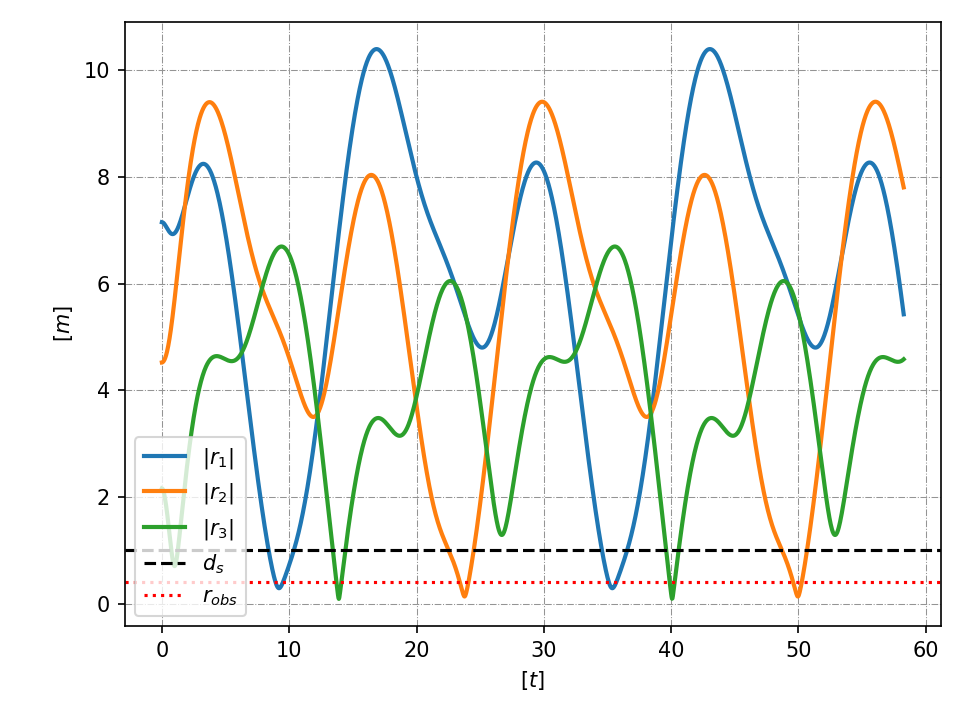 | 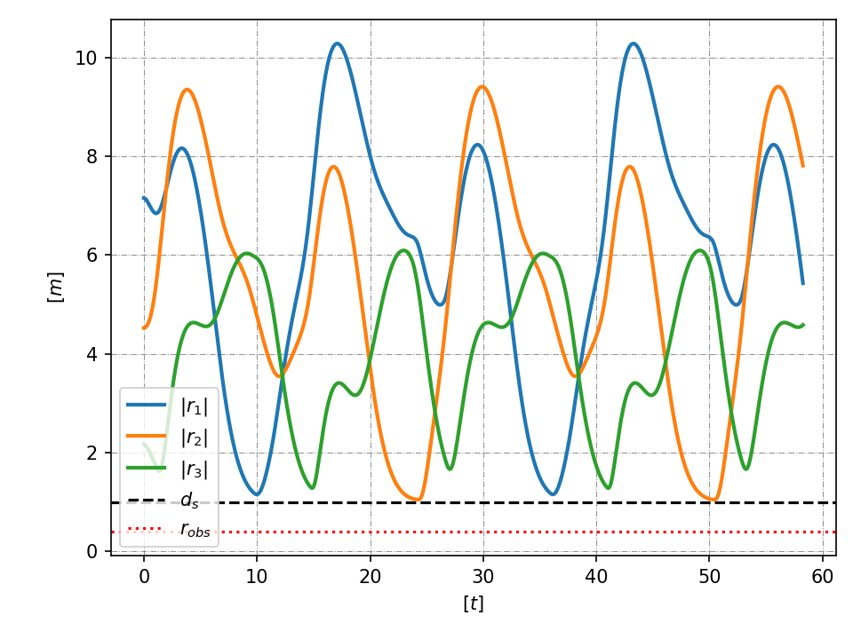 |
| Distancia a cada obstáculo: cruza `d_s` y `r_obs`, choca. | Nunca baja de `d_s = 1.0 m`. |
| 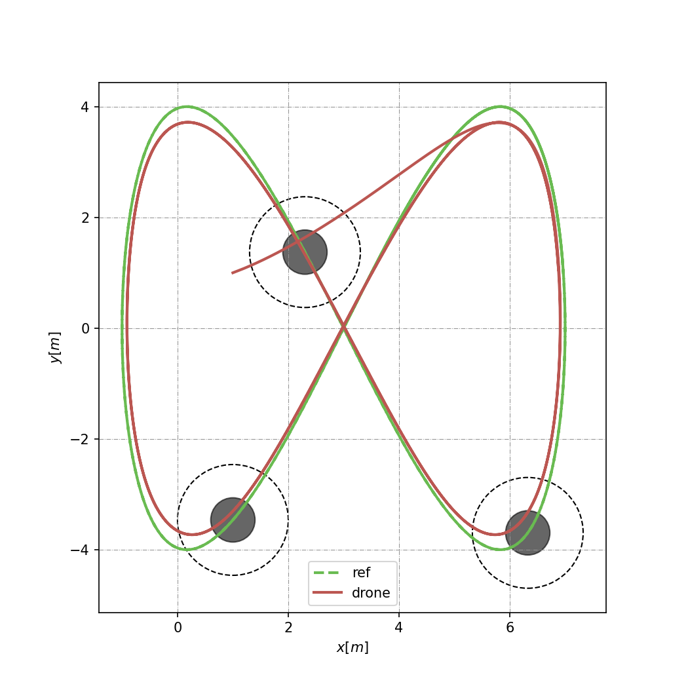 | 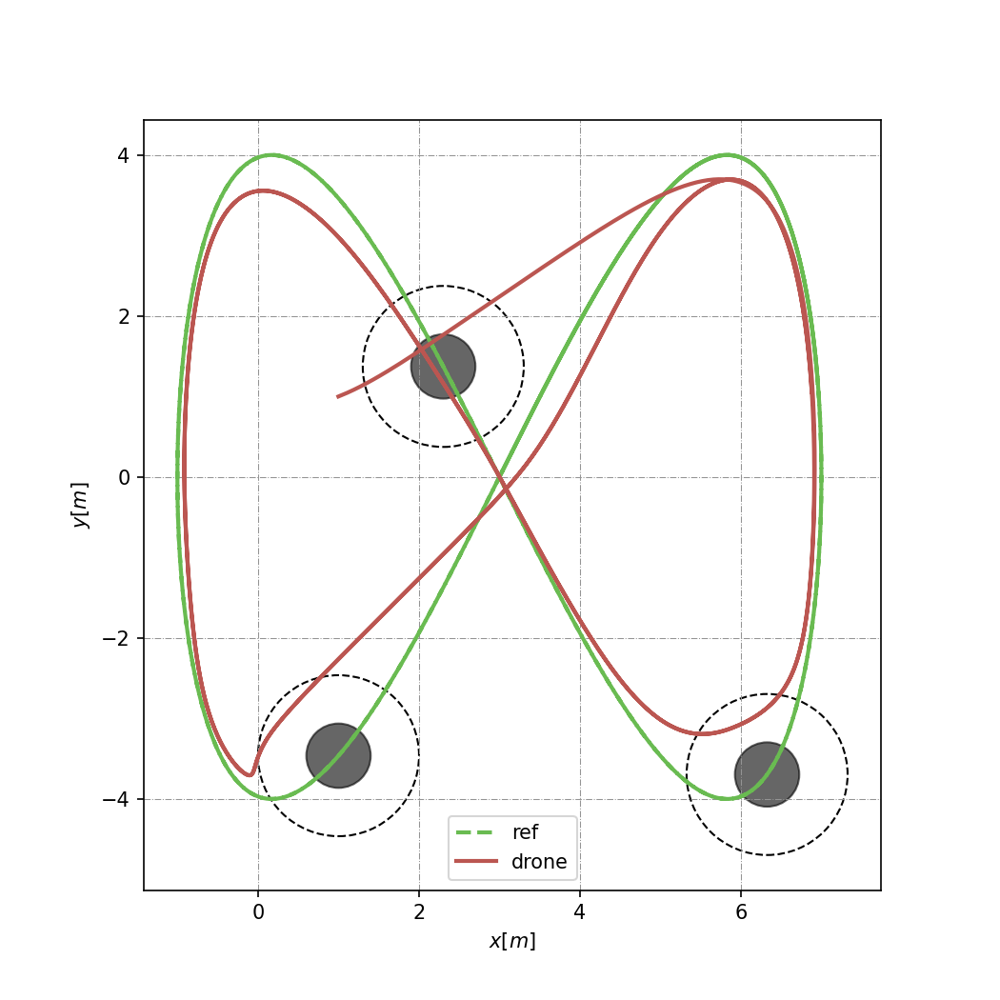 |
| Vista superior: pasa por el centro de los obstáculos. | Rodea las esferas (proyección 2D; la evasión es 3D). |
| 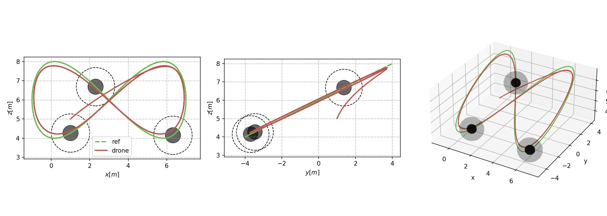 | 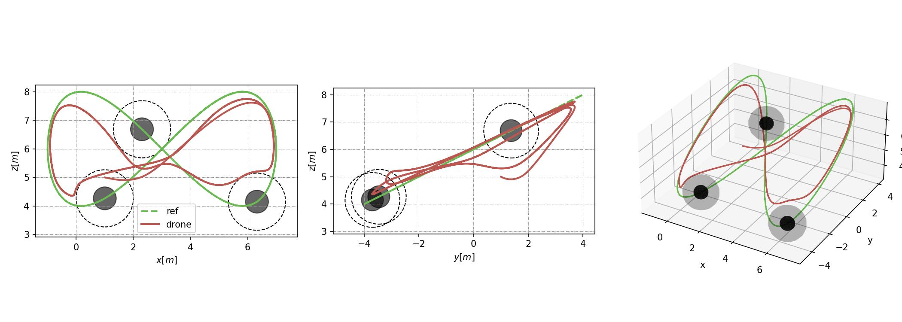 |
| Vistas x-z, y-z y 3D. | Vistas x-z, y-z y 3D. |
| 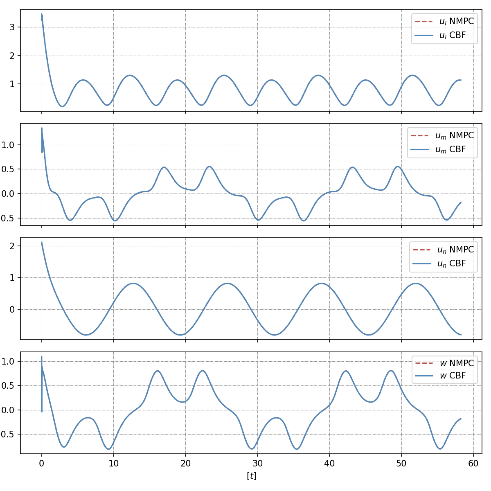 | 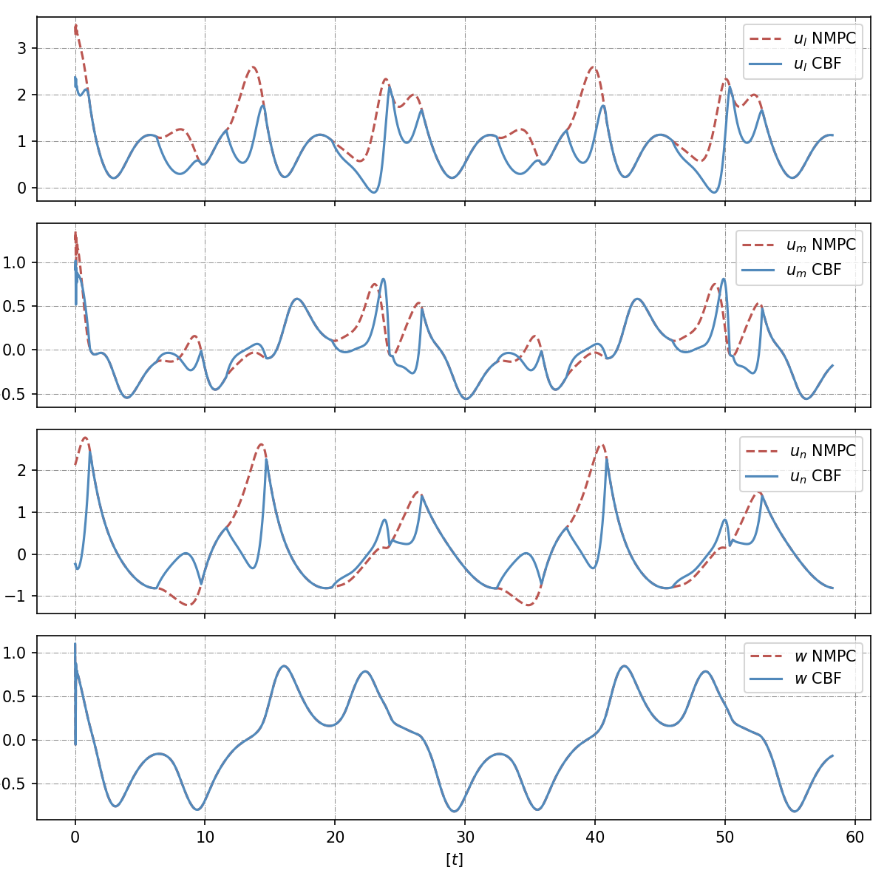 |
| `u_safe = u_nmpc`. | `u_safe` se separa de `u_nmpc` solo cuando la restricción está activa. |

Lo que ve la cámara con filtro (rango, bearing, visible/conocido por obstáculo):

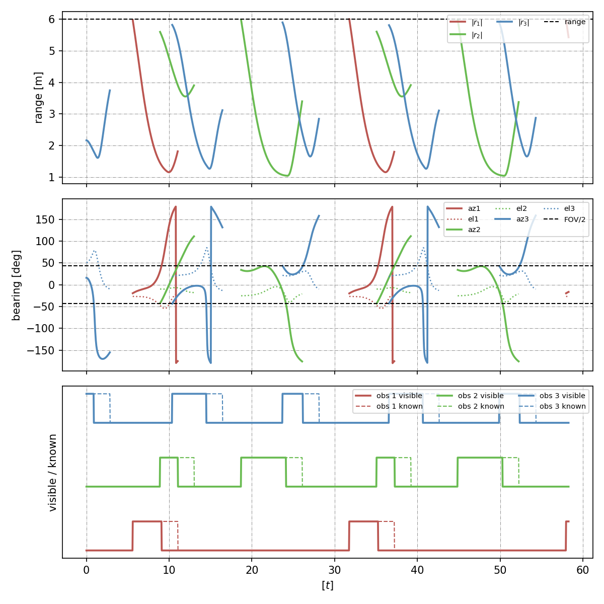

### Evasión: modelo Euler

| Sin filtro | Con filtro |
|---|---|
| 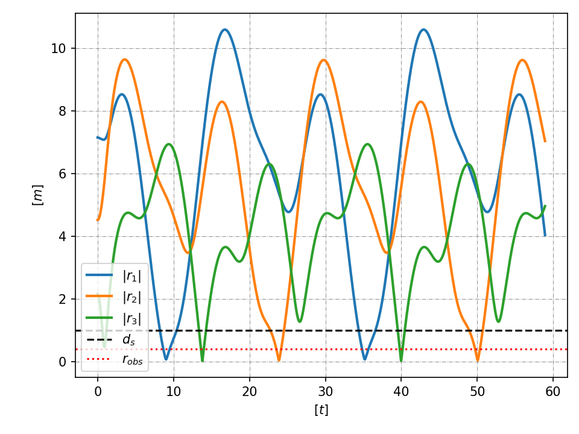 | 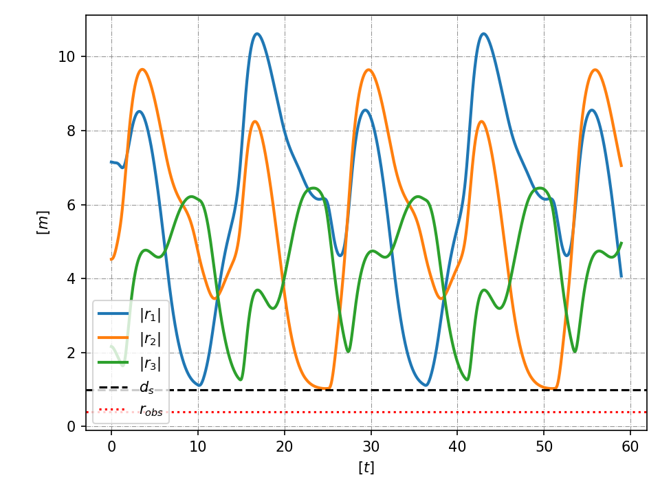 |
| 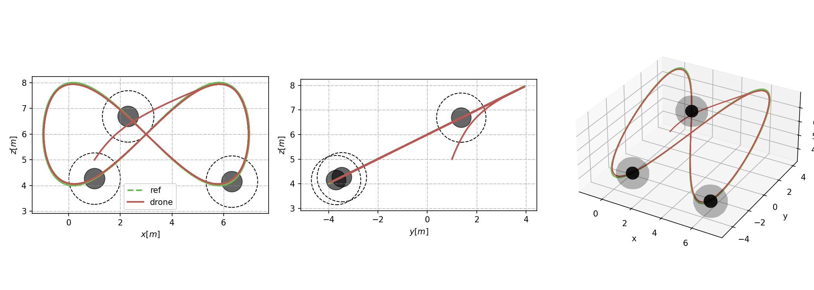 | 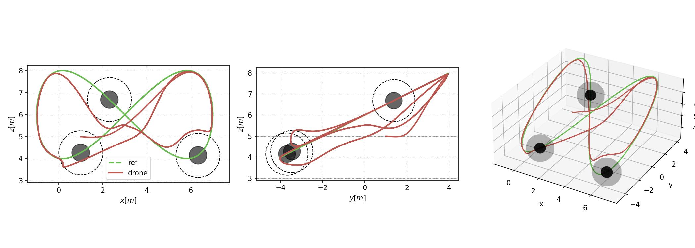 |

### Resultados de referencia (3 obstáculos sobre la trayectoria, r_obs = 0.4 m, d_s = 1.0 m)

| Variante | dist. mín. obs 1 | obs 2 | obs 3 |
|---|---|---|---|
| Quat, NMPC solo | 0.29 m | 0.14 m | 0.09 m (choca) |
| Quat, NMPC + CBF | 1.15 m | 1.05 m | 1.28 m |
| Euler, NMPC solo | 0.07 m | 0.04 m | 0.02 m (choca) |
| Euler, NMPC + CBF | 1.11 m | 1.03 m | 1.26 m |
